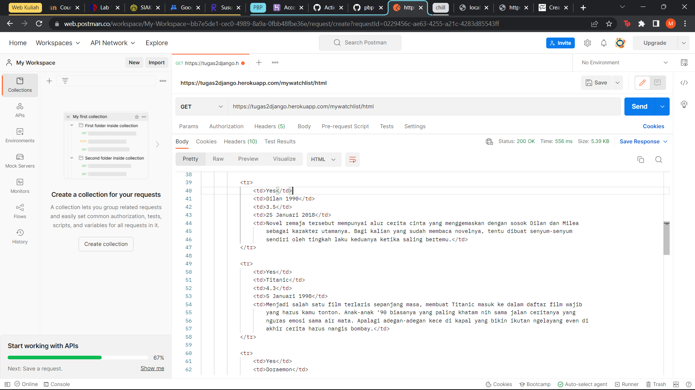
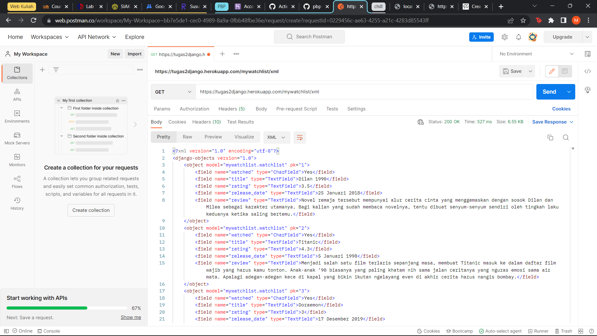
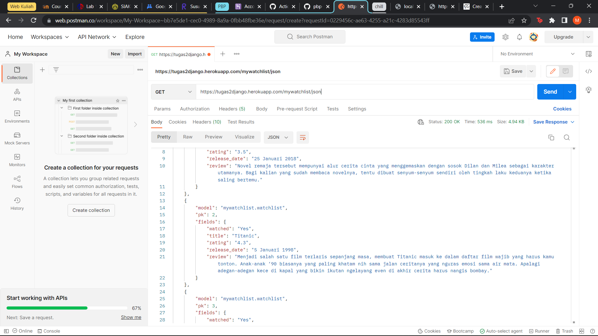
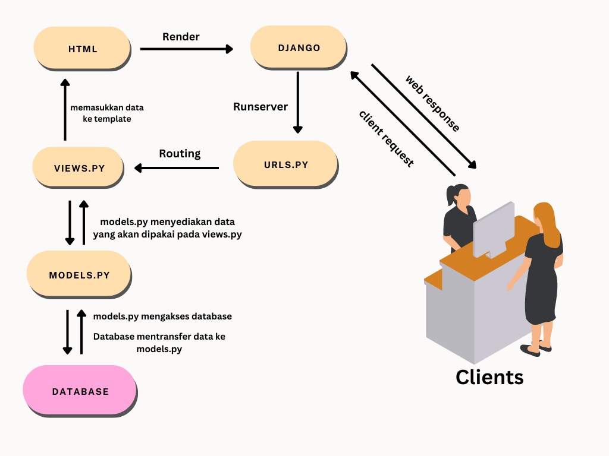

# TUGAS 3 PBP

Nama : Marc Salvadore Silitonga
NPM  : 2106705543
Link aplikasi Heroku : 

## 1. Perbedaan HTML, XML, dan JSON

HTML (Hypertext Markup Language) sering kali dipakai untuk menampilkan dokumen pada web browser karena bahasa markup standard. HTML juga memiliki tag tapi bersifat insensitif. Data yang terkandung didalamnya di wrap oleh tag.

XML(Extensible Markup Language) lebih bersifat case sensitif untuk tag nya yang dimana data disimpan dalamnya. File XML juga cenderung memiliki ukuran file yang besar dibanding JSON dan HTML. XML juga diperuntukan dalam penyimpanan dan pertukaran data.

JSON (JavaScript Object Notation) berguna untuk penyimpanan dan pertukaran data yang akan disimpan dalam bentuk string. JSON juga tidak memakai tag yang me-wrap data-nya. Memiliki ukuran file yang lebih kecil dari XML namun sulit dibaca untuk file skala besar.

## 2. Data Delivery dalam pengimplementasi sebuah platform

Saat kita ingin mengimplementasikan sebuah platform, maka pasti terjadi traffic data dimana data dipindahkan dari satu tempat ke tempat lain. Hal inilah yang akan menjadi peran dari data delivery. Data delivery ini yang akan mengirim data tersebut dalam format HTML, XML, dan JSON sehingga memungkinan berbagai platform untuk menerima data tersebut.

## 3. Implementasi checklist
Cara saya mengimplementasikan checklist diatas adalah dengan membuat aplikasi baru dengan menjalankan perintah python startapp (nama aplikasi). Lalu saya mengedit class urls untuk menambahkan app_name dan juga path yang nantinya akan digunakan untuk membawa user ke web. Saya juga membuat def show_mywatchlist(request) yang mengembalikan render(request, "mywatchlist.html", context), pada fungsi ini saya mengambil data-data yang nantinya akan saya buat. Pada class urls sebelumnya saya menambahkan path path('', show_mywatchlist, name='show_mywatchlist'). Masuk ke dalam pembuatan data, pertama saya membuat dahulu variabel yang akan menerima data tersebut pada class models. Masing-masing variabel tersebut saya berikan field yang sesuai dengan data yang akan masuk nantinya, contohnya adalah title = models.TextField() yaitu variabel title yang akan menerima string. Selanjutnya saya membuat fungsi untuk menyediakan berbagai format yaitu HTML, XML, dan JSON. Hal ini dilakukan dengan menambahkan def watch_xml(request), def show_xml_id(request, id), def watch_json(request), def show_json_id(request, id). Dimana masing-masing fungsi tersebut mendapatkan data melalui data = WatchList.objects.all(). Selanjutnya saya menambahkan path pada class urls agar format tersebut dapat diakses pada web. Path yang saya tambahkan adalah path('xml/', watch_xml, name='watch_xml'), path('json/', watch_json, name='watch_json'), path('json/<int:id>', show_xml_id, name='show_xml_id'), path('xml/<int:id>', show_json_id, name='show_jason_id'), dan path untuk format HTML-nya path('html/', show_mywatchlist, name='show_mywatchlist'). Selanjutnya saya membuat sebuah testing untuk memastikan kelancaran website pada test.py. Tahap terakhir adalah melakukan migration dengan menjalankan perintah makemigration, migrate, kemudian memasukkan data yang sudah saya buat ke dalam code ini yang nantinya akan ditampilkan pada web. Data tersebut saya buat pada initial_mywatchlist_data.json. 
Setelah tahap-tahap tersebut selesai saya melakukan add, commit, dan push sehingga code siap di depoly ke Heroku.

## POSTMAN

http://localhost:8000/mywatchlist/html

http://localhost:8000/mywatchlist/xml

http://localhost:8000/mywatchlist/json

# TUGAS 2 PBP
Nama : Marc Salvadore Silitonga
NPM  : 2106705543
Link aplikasi Heroku : https://tugas2django.herokuapp.com/katalog/

Bagan Penjelasan

Jelaskan kenapa menggunakan virtual environment? Apakah kita tetap dapat membuat aplikasi web berbasis Django tanpa menggunakan virtual environment?

Penggunaan virtual environtment ditujukan untuk memastikkan library di suatu project tidak berubah apabila kita melakukan perubahaan pada library tersebut. Jika kita tidak menggunakan virtual environtment, maka jika kita melakukan perubahaan pada library untuk sebuah project baru, project lama akan mengalami eror karena library-nya tidak sesuai.
Kita tidak bisa membuat aplikasi berbasis django tanpa menggunakan virtual environtment, karena jika django melakukan pembaharuan, versi baru tersebut akan tidak cocok dengan aplikasi atau program kita sehingga terjadi eror. Kita harus membalikan ke versi sebelumnya agar aplikasi dapat kembali berjalan.

Jelaskan bagaimana cara kamu mengimplementasikan poin 1 sampai dengan 4 di atas.
1. Pengambilan data dari model dan mengembalikannya ke dalam bentuk HTML, saya lakukan dengan membuat fungsi def yang menerima parameter request. Fungsi ini akan memasukkan request serta data barang yang akan di tampilkan dengan mengambil seluruh objek dari class CatalogItem dengan mengimport class moduls dari katalog dan memasukkannya ke dalam katalog html menggunakan import render, sehingga fungsi def tersebut akan me-return render(parameter, html, model data).
2. Routing dengan mengedit urls.py pada folder katalog dan folder project_django. Pada folder katalog, saya menggunakan modul dari django untuk mengaplikasikan output pada urls atau app yang dibuat dan katalog untuk memakai fungsi yang ada. Dari modul django saya menggunakan fungsi path untuk memberikan output dari katalog yang sudah dibuat. Katalog tersebut saya dapatkan dari class views dan mengambil fungsi show_katalog yang sudah dibuat pada tahap pertama. Pada folder project_django saya menambahkan path yang akan diisi oleh urls katalog tersebut.
3. Memetakan data dapat dilakukan menggunakan fungsi views.py yang memberikan query ke database berdasarkan model dari CatalogItem, kemudian mengasiggnya dengan variabel context yang nantinya akan dimunculkan oleh Django pada laman HTML.
4. Deployment dilakukan dengan membuat aplikasi terlebih dahulu pada Heroku, kemudian memasukkan APP NAME dan API KEY pada repository secret yang digunakan. Setelah tahap tersebut berhasil, Github akan terhubung dengan Heroku dan berhasil mendeploy aplikasi katalog.
